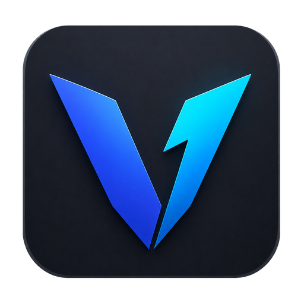
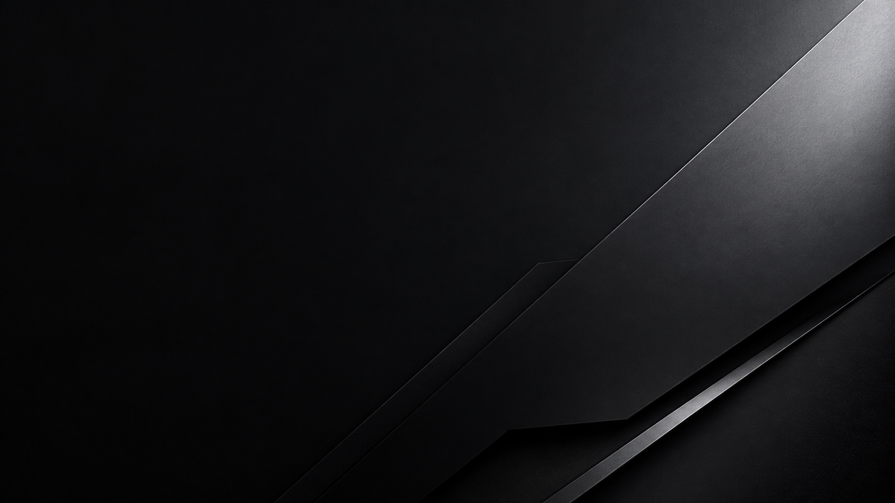

<p align="center">
  
</p>

<h1 align="center">Ralven</h1>

<p align="center">
  <strong>Mais desempenho. Menos complicação.</strong><br>
  Gerenciamento, diagnóstico e otimização transparente do Windows, com uma área especializada para FiveM sobre GTAV Legacy.
</p>

<p align="center">
  <a href="https://vemryx.com/Ralven/"><strong>Baixar para Windows</strong></a>
  &nbsp;·&nbsp;
  <a href="https://vemryx.com/Ralven/">Página oficial</a>
  &nbsp;·&nbsp;
  <a href="docs/safety.md">Segurança</a>
  &nbsp;·&nbsp;
  <a href="docs/architecture.md">Arquitetura</a>
</p>

<p align="center">
  <a href="https://github.com/marquezinii/Ralven/actions/workflows/ci.yml"></a>
  <a href="https://vemryx.com/Ralven/"></a>
  
  
</p>



> [!IMPORTANT]
> O módulo FiveM do Ralven suporta somente **GTAV Legacy**. GTAV Enhanced é identificado e bloqueado com segurança até existir um adaptador dedicado, pesquisado e testado.

## Seu PC em um lugar, FiveM com profundidade

Otimizar analisa automaticamente o computador, recomenda Leve, Médio ou Agressivo conforme RAM, CPU, GPU/VRAM e espaço livre, e ajusta o Windows sem exigir FiveM ou GTA V. O plano geral reúne diagnósticos locais de hardware, armazenamento, drivers, tela, rede, memória e estabilidade com ações conservadoras já tipadas, como Modo de Jogo, captura em segundo plano, energia, responsividade visual e temporários antigos. Sistema mostra dentro do Ralven as informações locais do PC e a saúde agregada de antivírus, firewall e atualizações automáticas informada pela Central de Segurança do Windows. Aplicativos reúne descoberta, instalação, inventário gerenciado, atualização individual ou em lote, atualizações ignoradas e desinstalação de pacotes encontrados nas origens confiáveis `winget` e `msstore`, sempre mostrando pacote e origem antes de executar. Jogos reúne os títulos compatíveis e hoje oferece FiveM sobre GTAV Legacy, preservando o fluxo especializado: detecta o ambiente, monta um plano próprio e mostra o que será alterado antes de executar. Cada ação declara em qual escopo pode entrar, suas pré-condições, risco, resultado e rollback quando aplicável.

| Você vê | O que isso significa |
| --- | --- |
| Diagnóstico local | CPU, GPU, memória, armazenamento/TRIM, rede, energia, drivers, tela, inicialização, proteções do Windows, mouse, estabilidade e, no módulo especializado, FiveM/GTA V. |
| Plano antes da execução | Perfil, ações, impacto, privilégios e condições de cada alteração ficam explícitos. |
| Execução verificável | Snapshot, validação, journal local, progresso real e recuperação fazem parte do fluxo. |
| Histórico útil | Resultado por ação, relatório técnico sanitizado e comparação local antes/depois. |

## Perfis com escopo conhecido

| Perfil | Foco |
| --- | --- |
| **Leve** | Ajustes suaves, com prioridade para preservar a experiência visual. |
| **Médio** | Equilíbrio entre qualidade, responsividade e consistência. |
| **Agressivo** | Reduz efeitos e opções pesadas para máquinas mais limitadas. |

Perfis são composições de ações conhecidas — não listas genéricas de "tweaks". Manutenção de dados é sempre opt-in; caches protegidos, entitlements, plugins e autenticação nunca são tratados como lixo.

> [!WARNING]
> Nenhum software pode prometer FPS, ping ou ausência de stutter em todo PC ou servidor. O Ralven não desativa Defender, Firewall, SmartScreen ou UAC; não injeta código; não modifica binários ou memória do jogo; e não usa prioridade Realtime, afinidade fixa ou debloat genérico.

## Segurança por projeto

Uma alteração persistente passa por **descobrir → planejar → validar → aplicar → verificar → registrar**. O aplicativo principal não fica permanentemente elevado: operações administrativas usam um broker efêmero, tipado e allowlisted.

Dados como `game-storage`, `nui-storage`, `ipfs`, `CitizenFX.ini`, plugins, `ros_id.dat` e entitlements digitais são protegidos. O produto valida instalação, processos, caminhos e reparse points antes de alterar qualquer coisa.

Leia a [política de segurança](docs/safety.md) e as [evidências técnicas](docs/research.md).

## O que já está disponível

| Área | Disponível hoje |
| --- | --- |
| Otimizar | Plano geral do Windows independente de FiveM/GTA, com diagnóstico, prévia, confirmação, progresso real, resultado por ação e rollback. |
| Sistema | Informações internas do PC, saúde agregada informada pelo Windows e leitura/ajuste confirmado do Modo de Jogo e da gravação histórica; atalhos nativos ficam como ações secundárias. |
| Aplicativos | Centro de pacotes com descoberta, instalados gerenciados, atualizações individuais/em lote, lista de ignorados e desinstalação via WinGet; limitado às origens confiáveis WinGet Community e Microsoft Store, com confirmação antes de cada mutação. O inventário local e os atalhos nativos continuam disponíveis. |
| Jogos | Catálogo interno com FiveM sobre GTAV Legacy e seu plano especializado, sem reutilizar ações do jogo no escopo geral. |
| Conta | Cadastro e login por e-mail, verificação, recuperação, senha, troca de credenciais e exclusão; Google usa OAuth 2.0 + PKCE quando a credencial desktop é fornecida ao build. |
| Privacidade | ID token somente em memória, refresh token protegido por DPAPI e telemetria limitada por consentimento. |
| Relatos de bug | Envio explícito com campos validados, e-mail e trecho de log opcionais — sem anexos automáticos. |
| Atualizações | Feed assinado, validação de origem/tamanho/SHA-256, staging, ativação atômica, health-check e rollback. |
| Operação privada | Dashboard autenticado para métricas e bugs, filtros defensivos e avisos ao vivo para o aplicativo. |

## Instalação e atualização

Baixe apenas pela [página oficial do Ralven](https://vemryx.com/Ralven/). Instalador, manifestos assinados e pacotes versionados são publicados pelo mesmo workflow no domínio da Vemryx.

Após sua confirmação, a atualização verifica origem e integridade, preserva a versão anterior e só confirma a nova versão quando ela sinaliza saúde.

> [!NOTE]
> Os binários ainda não têm assinatura Authenticode pública. SmartScreen pode pedir confirmação por reputação. Confira a origem, a tag e o SHA-256; nunca desative proteções para instalar o aplicativo.

## Privacidade

O diagnóstico é local por padrão. Telemetria e crash reporting são sanitizados, allowlisted e nunca alteram o resultado de uma otimização. O dashboard não recebe arquivos pessoais, credenciais, tokens, cookies, clipboard, paths completos, dumps ou logs completos sem uma ação explícita.

Veja [telemetria](docs/telemetry.md) e [relatos de bug](docs/bug-reports.md).

## Desenvolvimento

Requisitos: Windows 10/11 x64, [.NET SDK 10.0.303](https://dotnet.microsoft.com/download/dotnet/10.0) e Node.js 24.19.0 LTS.

```powershell
dotnet restore Ralven.slnx
dotnet build Ralven.slnx --configuration Release --no-restore
dotnet run --project tests/Ralven.Tests/Ralven.Tests.csproj --configuration Release --no-build -- --minimum-expected-tests 1
.\scripts\Verify-Safety.ps1
```

Para abrir uma demonstração segura sem FiveM/GTA instalado:

```powershell
.\scripts\Install-DevelopmentShortcut.ps1 -Build
```

Ela usa dados sintéticos e não grava configurações nem executa ações do sistema.

## Arquitetura

```text
App             WPF, conta, configurações e serviços de aplicação
Contracts       DTOs, IDs e contratos duráveis
Core            políticas, catálogo, planos e rollback
Windows         descoberta e integrações de Windows/FiveM
Broker          operações administrativas tipadas e allowlisted
Launcher/Updater atualização transacional e supervisão pós-update
Worker/Dashboard backend de conta, telemetria, bugs e operação privada
Website         site público estático
```

Consulte [docs/architecture.md](docs/architecture.md) para as fronteiras completas e [`assets/brand`](assets/brand/) para a biblioteca oficial de identidade.

---

Ralven é um projeto comunitário independente, sem afiliação, endosso ou patrocínio de Rockstar Games, Cfx.re ou FiveM. Gerações anteriores estão sem suporte; apenas dados locais pessoais conhecidos podem ser importados de forma unidirecional na primeira abertura.
